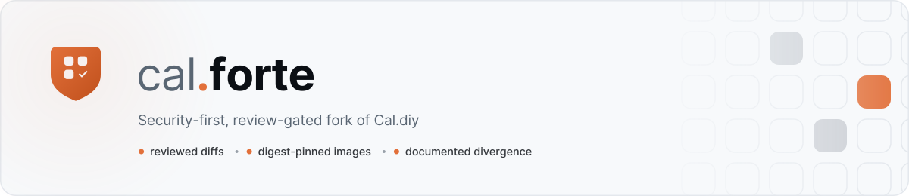

  <picture>
    <source media="(prefers-color-scheme: dark)" srcset="docs/brand/forte-banner-dark.svg">
    
  </picture>

  
  
  
  
  
  
  

> [!IMPORTANT]
> **cal.forte — a hardened, controlled fork of Cal.diy. This is not upstream.**
> Changes are reviewed on `develop`; deployable images come only from reviewed tags on
> `release`. Use a versioned, architecture-specific digest — never `latest` as a trust anchor.

A security-first, review-gated fork of Cal.diy (the MIT community edition of Cal.com).
Goal: a stable, hardened, **auditable** self-host — stay current on upstream security
fixes, keep fork drift small, and shrink the attack surface. Born out of a real self-host
compromise; every change here is deliberate and documented.

**Upstream review:** Last checked **2026-08-10** through [`176037d0af`](https://github.com/rubennati/cal.diy/commit/176037d0afbe572f870a3c702985e7cd83fe6c0c). [Full fork status →](FORK_STATUS.md)

**Fork changes:** Security defaults, telemetry, CI, container runtime, and release handling
intentionally differ from Cal.diy. [See the public divergence register →](FORK_DIVERGENCE.md)

**Latest release:** [`v6.2.0-6`](https://github.com/rubennati/cal.diy/releases/tag/v6.2.0-6)
from [`9b9df424e3`](https://github.com/rubennati/cal.diy/commit/9b9df424e3f3ad94fd4a5fc4c5387764f1dbce65).
[Full release evidence →](FORK_STATUS.md#latest-release-evidence)

## Branch model

| Branch    | Purpose                                   | Deploy?           |
|-----------|-------------------------------------------|-------------------|
| `main`    | Untouched upstream mirror                 | no                |
| `develop` | Fork integration and review               | no                |
| `release` | Reviewed source for the GHCR Docker image | tag / digest only |

- Image: `ghcr.io/rubennati/cal.diy` — consume a **reviewed tag/digest**, never `latest`
  (latest release recorded in [FORK_STATUS.md](FORK_STATUS.md)).
- Downstream deployment: [`secure-docker-blueprint`](https://github.com/rubennati/secure-docker-blueprint/tree/main/apps/caldiy).
- Exact reviewed diff vs upstream: **https://github.com/rubennati/cal.diy/compare/main...develop**
- Exact release diff vs upstream: **https://github.com/rubennati/cal.diy/compare/main...release**

## Releases

The latest published image was built from `release` at
[`9b9df424e3`](https://github.com/rubennati/cal.diy/commit/9b9df424e3f3ad94fd4a5fc4c5387764f1dbce65):

- AMD64: `ghcr.io/rubennati/cal.diy:v6.2.0-6@sha256:538cbb4a22733d262057c4b2a47c700117766816f57732925b077267a0dbe0f1`
- ARM64: `ghcr.io/rubennati/cal.diy:v6.2.0-6-arm@sha256:5b2ffcb7fc0e752a40f079a4d580571da680af91238b0bdf1dbe170f246a2250`
- Evidence: [Release Docker run 33159543959](https://github.com/rubennati/cal.diy/actions/runs/33159543959)
- Downstream handoff: [secure-docker-blueprint issue #30](https://github.com/rubennati/secure-docker-blueprint/issues/30)

Tags are architecture-specific; there is currently no combined multi-architecture manifest.
See [FORK_STATUS.md](FORK_STATUS.md) for the maintenance snapshot and
[CALDIY_RELEASE_CONTRACT.md](CALDIY_RELEASE_CONTRACT.md) for the downstream trust contract.

## How cal.forte differs from Cal.diy

cal.forte maintains **reviewed, deliberate divergence** from upstream. Divergence is not a goal —
it is a cost, accepted only where the fork's purpose requires it. Every material change is
recorded with its provenance, security impact and licence status.

| Category | What it means here |
|----------|--------------------|
| **Privacy / telemetry reduction** | Inert usage telemetry deleted rather than disabled, with a blocking CI guard against its return; ad-click integrations shipped off by default |
| **Security hardening** | Fork-owned security CI replacing upstream's estate; non-root web and API v2 runtimes; digest-pinned base images and SHA-pinned Actions |
| **Self-host productization** | The distribution presents its own identity, support contact and legal surface rather than upstream's — **in progress, not complete** |
| **Selected regression fixes** | Security-relevant upstream commits taken by default, one `cherry-pick -x` at a time |
| **Reduced hosted / commercial surface** | The Enterprise paywall *gating* is gone; dead upsell residue and unused scope removed where it had no importers |
| **Controlled feature additions** | Features are opt-in decisions, never defaults. **None have been added to date** |
| **Attack-surface reduction** | Runtime image slimmed; orphaned and unreachable code deleted rather than left inert |

**Where the records live**

| Question | Document |
|----------|----------|
| What is different today? | [FORK_DIVERGENCE.md](FORK_DIVERGENCE.md) |
| **What did we change, from what source, and what was verified?** | [FORK_IMPLEMENTATION_LEDGER.md](FORK_IMPLEMENTATION_LEDGER.md) |
| Which upstream commits were taken, deferred or rejected? | [UPSTREAM_REVIEW_LEDGER.md](UPSTREAM_REVIEW_LEDGER.md) |
| When is a change actually finished? | [FORK_PROCESS.md → Definition of Done](FORK_PROCESS.md#definition-of-done) |
| How is security assured, and what is *not* yet verified? | [SECURITY_ASSURANCE.md](SECURITY_ASSURANCE.md) |

**Provenance.** External repositories may be used as discovery or reference sources. Material
implementations are independently evaluated for provenance, licence compatibility and security
impact before incorporation into cal.forte. Each material change records its implementation
relationship, source usage and licence disposition in the
[implementation ledger](FORK_IMPLEMENTATION_LEDGER.md); the completion rule is
[FORK_PROCESS.md → Definition of Done](FORK_PROCESS.md#definition-of-done), and the security
model is [SECURITY_ASSURANCE.md](SECURITY_ASSURANCE.md).

**Two honest caveats.** Branding is only partly applied — the published image still carries some
upstream defaults, and its Terms/Privacy links still point at Cal.com. And two commercial Cal.com
prompts remain reachable in a fresh install, one of them on the public booking page. Both are
tracked as open issues; see [docs/SELF_HOST_PRODUCTIZATION.md](docs/SELF_HOST_PRODUCTIZATION.md).

## 📚 Documentation & knowledge base

**Using or operating cal.forte? Start at [docs/README.md](docs/README.md)** — overview,
capabilities, getting started, configuration, security model, operations and roadmap.

The records below are the fork's engineering memory. You should not need them to run the
product.

Everything we know about this fork, grouped. Entry point for tooling: [.ai/index.md](.ai/index.md).

**Fork process & release**

| Doc | What |
|-----|------|
| [FORK_PROCESS.md](FORK_PROCESS.md) | branch contract & operating cycle |
| [FORK_STRATEGY.md](FORK_STRATEGY.md) | maintenance model, security-fix validation, sync cadence |
| [FORK_DIVERGENCE.md](FORK_DIVERGENCE.md) | public register of fork-added, modified and removed behavior |
| [UPSTREAM_SYNC.md](UPSTREAM_SYNC.md) | how upstream is pulled in (security-first) |
| [UPSTREAM_REVIEW_LEDGER.md](UPSTREAM_REVIEW_LEDGER.md) | commit-level accepted, partial, deferred and rejected upstream changes |
| [FORK_IMPLEMENTATION_LEDGER.md](FORK_IMPLEMENTATION_LEDGER.md) | what the fork actually implemented: provenance, licence, security impact, guards |
| [SECURITY_ASSURANCE.md](SECURITY_ASSURANCE.md) | security-assurance model — ASVS mapping, CI tiers, tooling, licence policy (design) |
| [RELEASE_PROCESS.md](RELEASE_PROCESS.md) · [IMAGE_BUILD.md](IMAGE_BUILD.md) | cutting & building a release |
| [SECURITY_REVIEW.md](SECURITY_REVIEW.md) · [CALDIY_RELEASE_CONTRACT.md](CALDIY_RELEASE_CONTRACT.md) | review gate & downstream trust |

**Understand the app (architecture · config · branding)**

| Doc | What |
|-----|------|
| [.ai/architecture.md](.ai/architecture.md) | monorepo layout, 3 config planes (env / DB / file), hardening levers |
| [.ai/env-reference.md](.ai/env-reference.md) | every env var: meaning, format, priority, recommendation |
| [.ai/branding.md](.ai/branding.md) | white-labeling (build vs runtime), CE-vs-EE table, paywall/teams reality |
| [docs/brand/](docs/brand/) | the fork's own identity: mark, wordmark, palette, and where it is *not* applied yet |

**Capability, security & licence audits (`docs/`)**

Point-in-time forensic audits of the tree at `41689d1d6e`, consolidated 2026-08-26 from a static pass, a
live-deployment session and an external-fork intake. They record evidence, not process — treat them as
dated findings, not standing rules. The **master** carries the single ranked candidate registry.

| Doc | What |
|-----|------|
| [docs/SELF_HOST_CAPABILITY_AUDIT.md](docs/SELF_HOST_CAPABILITY_AUDIT.md) | master inventory: active, stripped, stubbed, orphaned and residual capabilities + ranked candidates |
| [docs/PBAC_PLACEHOLDER_AUDIT.md](docs/PBAC_PLACEHOLDER_AUDIT.md) | authorization placeholder call graph, per-endpoint verdicts, minimum reproducible tests |
| [docs/TEAM_CAPABILITY_EVALUATION.md](docs/TEAM_CAPABILITY_EVALUATION.md) | team architecture, missing layers, role model, invariants required before any team feature |
| [docs/LICENSE_AND_PROVENANCE_REVIEW.md](docs/LICENSE_AND_PROVENANCE_REVIEW.md) | MIT scope and notice duty, the AGPL/Commercial history boundary, what may not be restored |
| [docs/SELF_HOST_PRODUCTIZATION.md](docs/SELF_HOST_PRODUCTIZATION.md) | legal URLs, residual hosted-Cal upsells, hard-coded `cal.com` references |
| [docs/EXTERNAL_FORK_INTAKE.md](docs/EXTERNAL_FORK_INTAKE.md) | external-fork evidence register — discovery only, with per-claim verification verdicts |

**Harden & secure**

| Doc | What |
|-----|------|
| [.ai/hardening-checklist.md](.ai/hardening-checklist.md) | how/where to apply the top security actions |
| [config/cal.forte.env.example](config/cal.forte.env.example) | ready-to-use hardened env template (Brevo · MS · Zoom · Apple) |
| [.ai/slimming-analysis.md](.ai/slimming-analysis.md) | attack surface is config-controlled, not code |

**Operational layer (`.ai/`)**

| Doc | What |
|-----|------|
| [.ai/sync-log.md](.ai/sync-log.md) | timeline of sync / security / release rounds |
| [.ai/roadmap.md](.ai/roadmap.md) | open work |
| [.ai/decisions.md](.ai/decisions.md) · [.ai/state.md](.ai/state.md) · [.ai/project-brief.md](.ai/project-brief.md) | durable decisions · current state · brief |

**Engineering rules (adopted from upstream)** — [AGENTS.md](AGENTS.md) (= `CLAUDE.md`) ·
[agents/README.md](agents/README.md): 35 kept rules; cal.com team/PR-process rules removed.

## Security fix policy

Falling behind upstream on **security** fixes is the one drift this fork does not tolerate.
Security-relevant upstream commits are taken by default — even when a full sync is deferred.
Validate they are *real* fixes (CVE/advisory + diff, not just the commit title):
[FORK_STRATEGY.md → Security-fix validation](FORK_STRATEGY.md).

## Removed from upstream — and kept out

Upstream ships code that phones home. This fork removes it rather than switching it off,
because a disabled-by-default vendor integration still has to be re-audited by every
reviewer, and an upstream merge can silently re-arm it.

- **Usage telemetry** (Jitsu, `t.calendso.com`, with a vendor write key in the source) —
  deleted, along with the `CALCOM_TELEMETRY_DISABLED` flag, which gated nothing after
  upstream dropped `next-collect`. **Do not re-add that flag:** it would document a privacy
  control that does not exist. Enforced by `scripts/fork-guard-telemetry.sh`, a blocking
  `forte-ci` step that fails if the module, endpoint, key, flag or dependency reappear.
- **Ad-click tracking** (`gclid` / `li_fat_id`) — real and still present upstream; this fork
  ships it **off by default** in the image (`GOOGLE_ADS_ENABLED=0`, `LINKEDIN_ADS_ENABLED=0`).

Full list with rationale: [FORK_DIVERGENCE.md](FORK_DIVERGENCE.md). One caveat worth knowing
before you audit: `type-check` runs for only 8 of 113 packages, so a green CI run is not
proof that the whole tree compiles — [.ai/quality-gates.md](.ai/quality-gates.md).

## Capabilities at a glance

Community Edition (MIT); Enterprise Edition is absent. The old "buy Enterprise" paywall is
already removed.

| | |
| --- | --- |
| **Supported** | booking pages and event types · availability · calendar and conferencing integrations · sign-in incl. OAuth · **API-key management** · Zapier and Make · personal webhooks · automatic database migrations · AMD64 and ARM64 images with provenance and SBOMs |
| **Limited** | **scheduled/background jobs** — the container ships no scheduler, so reminders and calendar refresh need an external trigger · Microsoft/Entra tenant restriction |
| **Planned** | **REST API v2** — an explicit roadmap decision; not in the current release |
| **Evaluating** | Teams · Organizations · PBAC · team webhooks · Platform/OAuth clients — present in code, **direction not decided** |
| **Not included** | Workflows · Insights · SAML/SSO · video recordings · API v1 · usage telemetry (removed) |

**The current release ships the web runtime only.** There is no API service in the
published image, so there is no cal.forte REST API endpoint to call today.

**API keys work; the REST API is not shipped.** Keys are created in the UI and consumed
today by the web integrations (Zapier, Make). They are not yet credentials for a public
REST API — see [the API v2 roadmap](docs/guide/roadmap/api-v2.md).

**Evaluating is not a promise.** Teams, Organizations and PBAC have substantial code and
schema, but no recorded product decision to ship them — see
[#28](https://github.com/rubennati/cal.diy/issues/28). Code presence is not a commitment.

This is a summary. The canonical registry — with what Cal.com offers, what upstream
Cal.diy claims, what cal.forte supports, and how deeply each has been verified — is
**[docs/guide/capabilities.md](docs/guide/capabilities.md)**. Where the two disagree, the
capability matrix is the product answer and this summary needs fixing.

📖 **[Full documentation →](docs/README.md)**

For the full upstream README (install reference), see the [`main` branch](https://github.com/rubennati/cal.diy/blob/main/README.md).
